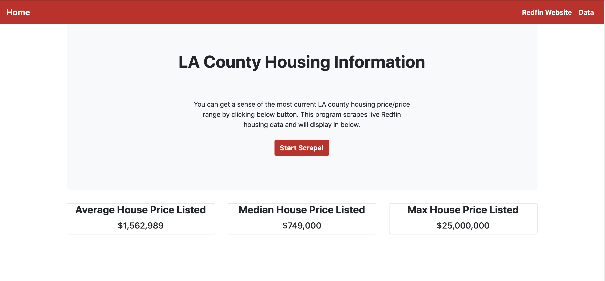
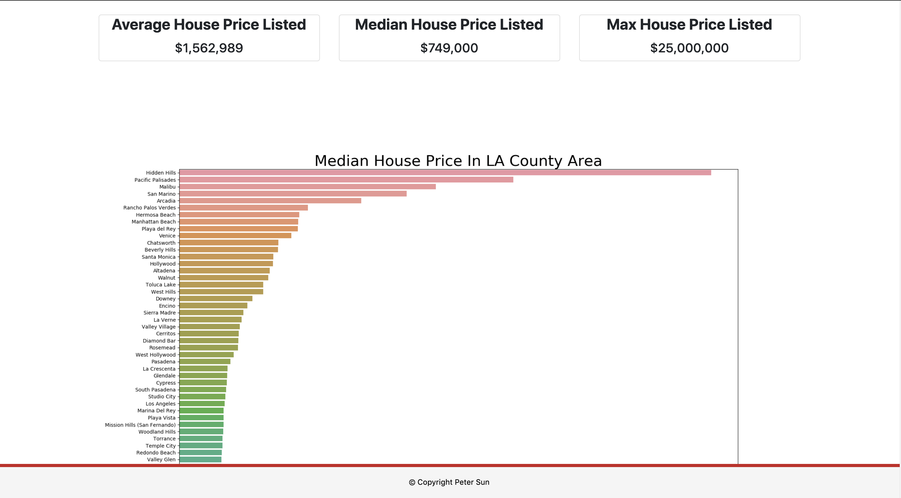
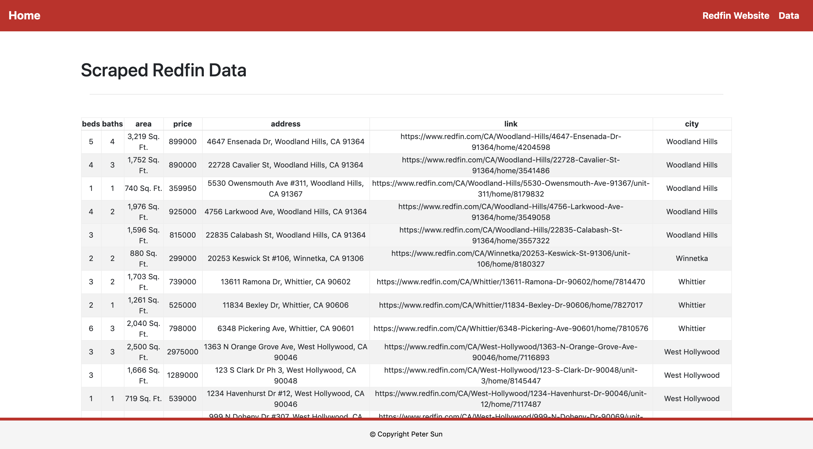

# ETL_Redfin_housing_info
### **Objective:**
#### This flask app scrapes live Los Angeles County house information from Redfin. It displays summary statistics and graph on the home page, and raw data on data page.(If you can do a mental math by browsing all LA county house information on Redfin, you can leave the click Redfin website tag :). 

### **Library:**
* bs4
* Flask
* PyMongo
* Pandas
* splinter
* time
* re
* ast
* matplotlib
* seaborn

### **Display**

  

  

